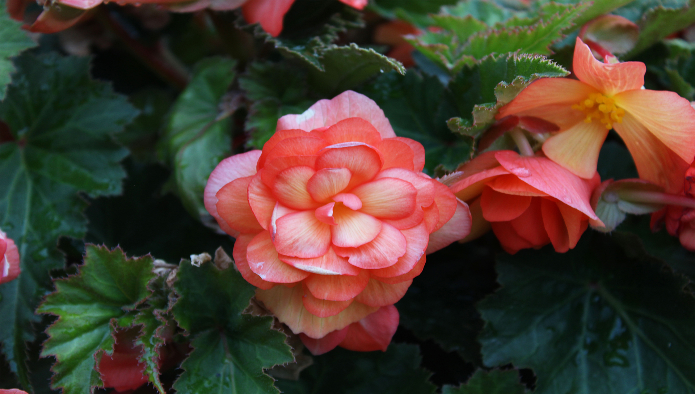

# {{ title }} 
    
### Click the dots to see some of my works!

<!-- Slideshow container -->

  <!-- Full-width images with number and caption text -->
  

    

    
    
Groggy Day At The Hospital: Red Lake Ontario

  

  

    

    
    
Perrault Lake: Perrault Falls Ontario

  

  
  

    

    
    
Howey Bay: Red Lake Ontario

  

  

    

    
    
Portraits demo (serious)

  
  

  

    

    
    
Close Up Of Flowers: Red Lake Ontario

  
 

  

    

    
    
Roses Close Up: Red Lake Ontario

  
 
  
  

    

    
    
Portraits demo (silly)

  
 

  

    

    
    
Norseman Plane: Red Lake Ontario

  
 
  
  

    

    
    
Perrault Lake 2: Perrault Falls Ontario

  
 
  
  

    

    
    
Wasp Close Up: Thunder Bay Ontario

  
 

  <!-- Next and previous buttons -->
  <a class="prev" onclick="plusSlides(-1)">&#10094;</a>
  <a class="next" onclick="plusSlides(1)">&#10095;</a>

 

<!-- The dots/circles -->

  
  
  
  
  
  
  
  
  
  

     

